Language Expander
=================

Takes in a description of languages and outputs a parser converting 
high level languages into low level ones. This makes it possible to 
automate the unraveling of a complicated chain of 
[extension by definitions](https://en.wikipedia.org/wiki/Extension_by_definitions)
like those found in Set Theory.

Converter, when run, opens a repl that allows the following commands:
 - `<lang> <formula>` -- prints the formula unambiguously as a tree
 - `Convert<lang1>To<lang2> <formula_in_lang_1>` -- prints the version of the given formula converted to lang2

if <lang1> extends <lang2>, then <lang1> gains access to all the symbols defined in <lang2>

syntax available in all languages is:
  - `Eq(x,y)`
  - `formula && formula`
  - `formula || formula`
  - `formula -> formula`
  - `formula <-> formula`
  - `Not(formula)`
  - `ForAll var (formula)`
  - `Exists var (formula)`

language_file should be a file written in the syntax shown in the following example:

-------------------------------------------------------------------
```
BST:
relNew (In, 2)

BSTA: 
extending BST
funDef (Empty,0) ForAll z (Not In(z,o))
funDef (PowerSet,1) ForAll z (In(z,o) <-> ForAll w (In(w,z) -> In(w,v1)))
relDef (Subset,2) ForAll z (In(z,v1) -> In(z,v2))
funDef (Union,1) ForAll z (In(z,o) <-> Exists w (In(z,w) && In(w,v1)))
funDef (Singleton, 1) ForAll z (In(z,o) <-> Eq(z,v1))
funDef (Pairing, 2) ForAll z (In(z,o) <-> Eq(z,v1) || Eq(z,v2))

BSTB:
extending BSTA
funDef (BinUnion, 2) Eq(o,Union(Pairing(v1,v2)))

GroupT:
funNew (E,0)
funNew (Inv,1)
funNew (Mult,2)

GTComm:
extending GroupT
funDef (Comm,2) Eq(o,Mult(Inv(v1),Mult(Inv(v2),Mult(v1,v2))))
```
-------------------------------------------------------------------

Keep in mind this was made for personal use, so I was OK leaving things
kind of brittle. In particular, errors are handled extremely disgracefully.
Here's a list of all the possible pitfalls I could think of:

 - each block should be separated by a blank line
 - each language can extend at most one language
 - each language name should begin with a Capital
 - all symbols should start with a Capital
 - all variables should start with a lowercase letter
 - relNew and funNew create new symbols, with no definition
 - relDef and funDef define new symbols, coupled with a way to expand them
 - don't use relNew/funNew with extends
 - don't use relDef/funDef without extends
 - constant symbols are 0-arity functions
 - for definitions, the input variables should be called `v1` ... `vn`
 - for function definitions, the output variable should be called `o`
 - don't use v or o for anything else.

-------------------------------------------------------------------


